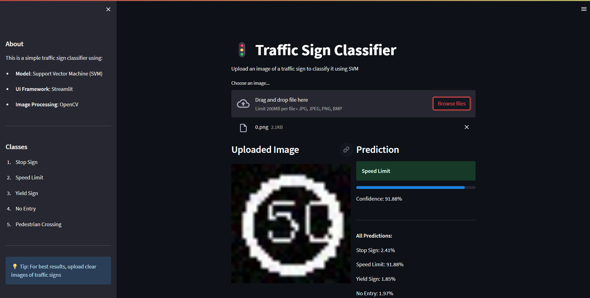

# Traffic Sign Classifier

A traffic sign classification project that trains a Support Vector Machine (SVM) on a custom dataset of 58 traffic sign classes and serves predictions through an interactive Streamlit web UI.



## What this repository contains

- `train.py` — loads images from `traffic_Data/DATA/`, trains an SVM model, evaluates it, and saves the model (`traffic_sign_model.pkl`) and `class_names.pkl`.
- `app.py` — Streamlit web UI to upload an image and get a prediction from the trained model.
- `traffic_Data/DATA/` — dataset folder containing 58 classes of traffic sign images (organized in folders 0-57).
- `labels.csv` — CSV file mapping class IDs to traffic sign names (58 classes total).
- `requirements.txt` — Python dependencies required to run/train the project.
- `PROJECT_DOCUMENTATION.md` — detailed documentation with architecture diagram and code explanations.

## Quick start (Windows PowerShell)

1. Create and activate a virtual environment

```powershell
python -m venv .venv
.\.venv\Scripts\Activate.ps1
```

2. Install dependencies

```powershell
pip install -r requirements.txt
```

3. Train the model (reads from `traffic_Data/DATA/` and saves `traffic_sign_model.pkl`)

```powershell
python train.py
```

4. Run the Streamlit app

```powershell
streamlit run app.py
```

Open the URL shown in the terminal (typically `http://localhost:8501`) to access the UI.

## Dataset

The project uses a custom dataset with **58 traffic sign classes**:

- Speed limits (5-80 km/h)
- Directional signs (go straight, left, right, etc.)
- Warning signs (zebra crossing, children crossing, curves)
- Restriction signs (no entry, no car, no horn, etc.)

Class names are defined in `labels.csv` and images are organized in `traffic_Data/DATA/` with one folder per class.

## Notes

- This project uses an SVM classifier for simplicity and speed. For production use, consider using a CNN (Convolutional Neural Network) for better accuracy on real-world images.
- See `PROJECT_DOCUMENTATION.md` for a detailed explanation of the code and the reasons behind chosen libraries.

## License

This project is provided as-is for demonstration and educational use. Feel free to adapt it.
